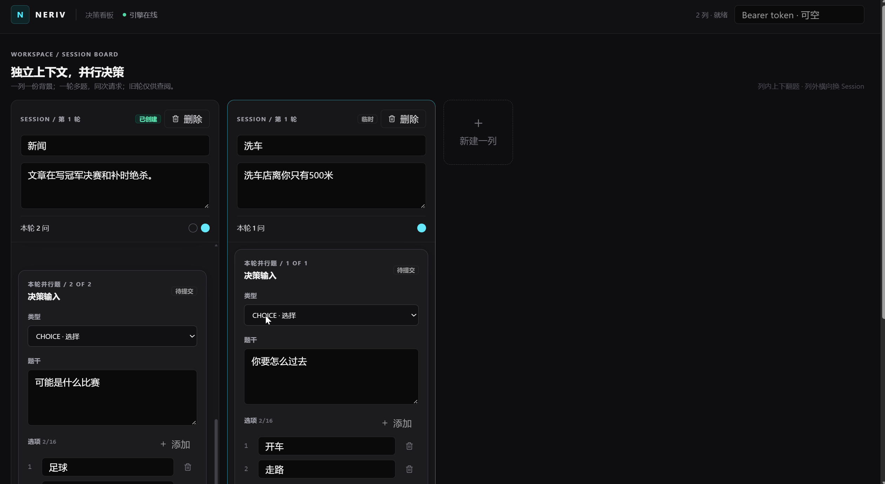

# Neriv 

Neriv 是基于 Qwen3-0.6B 的非生成式决策系统：输入背景、问题和 2～16 个候选，直接输出候选概率与独立的 Reject 概率，不生成或解析自然语言答案。



## 设计与能力

- **Model**：Qwen3-0.6B 编码共享状态、问题和候选；无候选位置编码的 Set Attention + Pointer Head 对动态候选集合打分，并保留 Reject 槽。支持 CHOICE、SCORE、NOUL、多问题共享状态和温度校准。
- **Engine**：Paged KV、前缀缓存与写时复制、动态批处理、容量背压和超时处理。Linux 可选 FlashInfer；Windows/Linux 均可使用 PyTorch Reference 后端。
- **Agent**：插件式 Decision/Capability、Session 状态投影、权限与风险策略、人工审批和审计。提供 `/api/v1/decide`、`/v1/systemone`、Session/插件/审批 REST API、MCP Server，以及 `/ui` Web 控制台。无令牌仅可评估。

## JevBench 公开集

使用 `calibrated-v2`、Reference Engine 和 JevBench 原生 `typesafe` 适配器，测试了公开的 original、easy、hard 共 **231 题**：231/231 请求成功且概率合法，**137/231 正确（59.31%）**，ECE **0.2401**，Brier **0.6159**。逐题记录、运行参数及汇总见 [`benchmark/v2/jevbench/`](benchmark/v2/jevbench/)。这是公开集结果，**不包含 sealed 题，不能视作官方总榜分数**。JevBench 只接受题目标签概率，System One 返回的是 Engine 候选概率在非 Reject 条件下的分布。

## 当前权重与快速启动

模型仓库：[linyaocai/Neriv-v2](https://huggingface.co/linyaocai/Neriv-v2)，其中 `base/` 是 Qwen3-0.6B 原始权重，`checkpoint/calibrated-v2/` 是本版训练及校准权重。推荐 Python 3.10+，NVIDIA GPU；无 GPU 可加 `--cpu`，但速度较慢。

```bash
git clone https://github.com/123skywalker/Neriv.git
cd Neriv
python -m venv .venv
source .venv/bin/activate
pip install -e '.[server]'
python -c "from huggingface_hub import snapshot_download; snapshot_download('linyaocai/Neriv-v2', local_dir='weights')"
neriv-serve --checkpoint weights/checkpoint/calibrated-v2 --model weights/base \
  --engine-backend reference --attention-backend sdpa --host 127.0.0.1 --port 8000
```

启动后打开 <http://127.0.0.1:8000/ui/>。Windows 在激活环境时使用 `.venv\Scripts\activate`；Linux CUDA 环境可将 Engine 后端换为 `flashinfer`（需安装对应依赖）。

## 训练数据范围

本版权重依次经过 Head/General SFT、Hardening、Reject Refresh 与校准。Head/General 使用 BoolQ、AG News、Banking77、SST-5、MultiNLI、Yelp Review Full、TREC、DBpedia-14、IMDb、Amazon Reviews Multi；Hardening/拒答阶段补充 Banking77、MASSIVE、CLINC150、SciQ、ARC-Challenge、OpenBookQA 等来源，并对训练切分构造难例。数据来源与固定 revision 见 `jev_like/data/prepare.py` 和 `scripts/prepare_hardening.py`。**Pro 训练仍在进行，不属于本次发布权重；JevBench 仅用于测试，未用于训练或校准。**

原始 Qwen3 权重及许可证见 [Qwen/Qwen3-0.6B](https://huggingface.co/Qwen/Qwen3-0.6B)。本仓库不包含训练数据集或本地密钥。
